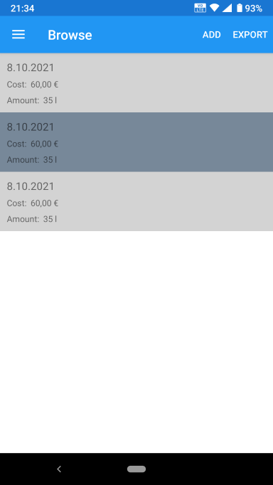

# FuelTracker
An application to easily collect fuel consumption statistics for analysis in external programs.

Minimum version: Android 6 (Marshmallow).
Targeted version: Android 10 (Q)
Tested on: Nokia 6.1 running Android 10.

# Usage
- In the app, you can save the details of fuel refills.
- You can then export (share) the data as a JSON file to someplace convenient. (I'd recommend a dedicated folder in Google Drive/Onedrive for this.)
- Install the desktop client for the cloud service of your choice and enable offline access for the specific folder. (Not mandatory but makes the process more convenient.)
- Open the attached excel spreadsheet on your computer (It uses Power Query, so it might not work on excel versions older than 2016).
- Point the File path present on one of the cells to the locally synced cloud folder.
- Refresh the data.
- (You may wish to hide the first entry as most calculations won't work for it. )

You can use this excel file for analyzing the data https://github.com/SpaceBeeGaming/FuelTracker/blob/master/FuelTrackerAnalysis.xlsx.

# Screenshots

### App
 
 

### Analysis spreadsheet:

